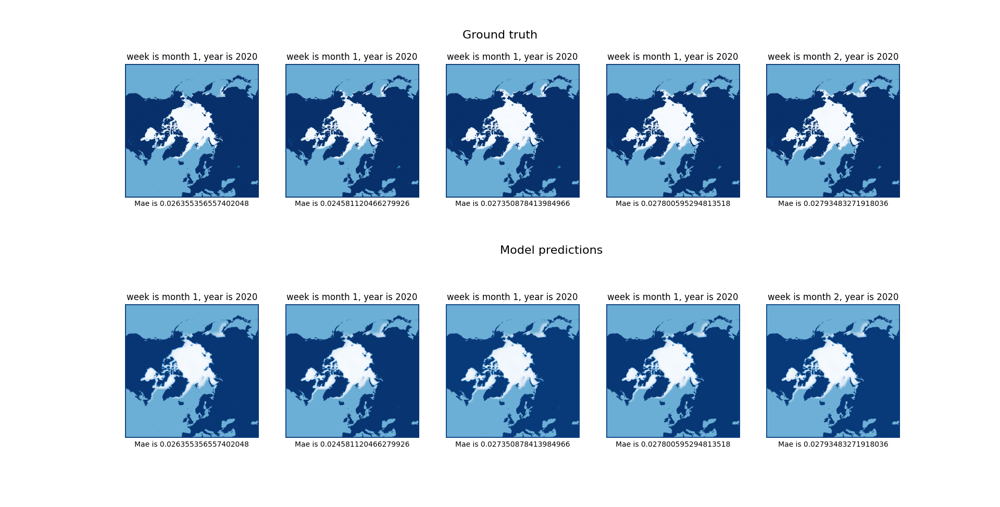

# Artic_project

# Проект построения ледового покрытия в арктическом регионе с течением года. В данном решении использовалась модель U-net, в качестве данных предсатвлены матрицы покрытия ледовой коркой начиная с 1979. Апроксимация по неделям представила наилучшее соотсвествие между единичной временной шкалой входа и выхода (в качестве единицы времени используется 1 неделя). В конечном результате качество модели составляет 2% ошибок.

# Пример предсказания

